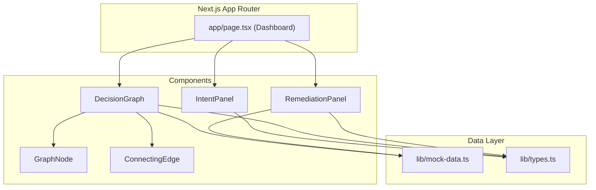

# Design Document: CogniGraph Intent-Alignment Dashboard

## Overview

CogniGraph is a single-page intent-alignment dashboard rendered as a three-panel layout within a Next.js 14 App Router application. The dashboard consumes a static TypeScript mock data file and presents:

1. **Intent Panel** (left, 25%) — textarea for product requirement input
2. **Decision Graph** (center, 50%) — node-based visualization of requirement-to-code-file relationships with CSS-drawn connecting edges
3. **Remediation Panel** (right, 25%) — formatted JSON reasoning logs and syntax-highlighted unified diffs

The UI follows a dark-mode-first aesthetic (slate-950 background) with a semantic color system: emerald-500 for alignment/success, rose-500 for drift/errors, and amber-500 for patch-ready states. All interactive state is managed via React `useState` hooks with no external state libraries or backend dependencies.

### Key Design Decisions

| Decision | Rationale |
|----------|-----------|
| CSS Grid for three-panel layout | Native browser support, straightforward percentage-based column sizing, no JS layout calculations |
| CSS-based connecting edges (no graph library) | Keeps bundle size minimal; the graph is a simple bipartite layout, not a general force-directed graph |
| Static TypeScript mock data file | Type-safe data contracts, no runtime fetching, enables direct import with tree-shaking |
| shadcn/ui primitives | Consistent dark-mode theming via CSS variables, accessible components out of the box |
| useState over external state management | The state surface is small (one textarea string + selected node), no cross-component synchronization needed |

## Architecture



### Data Flow

1. `app/page.tsx` imports mock data and passes it as props to child panels
2. `IntentPanel` manages its own textarea state via `useState<string>`
3. `DecisionGraph` receives nodes and edges arrays; renders `GraphNode` components and `ConnectingEdge` connectors
4. `RemediationPanel` receives remediation entries array and renders formatted output
5. No data flows upward — each panel is self-contained once it receives props

### Directory Structure

```
src/
├── app/
│   ├── layout.tsx          # Root layout with dark theme, font setup
│   ├── page.tsx            # Dashboard page (server component wrapper)
│   └── globals.css         # Tailwind directives + CSS variables
├── components/
│   ├── intent-panel.tsx    # Intent specification input panel
│   ├── decision-graph.tsx  # Live decision graph panel
│   ├── remediation-panel.tsx # Codex remediation engine panel
│   ├── graph-node.tsx      # Reusable graph node card
│   └── connecting-edge.tsx # CSS-based edge connector
├── lib/
│   ├── types.ts            # TypeScript interfaces for mock data
│   └── mock-data.ts        # Static mock data
└── components/ui/          # shadcn/ui primitives (Card, Badge, Textarea, etc.)
```

## Components and Interfaces

### Page Component (`app/page.tsx`)

The root dashboard page is a client component (due to state management needs). It:
- Imports mock data from `lib/mock-data.ts`
- Renders a CSS Grid container with three columns (`grid-cols-[25%_50%_25%]`)
- Passes relevant data slices to each panel

```typescript
// app/page.tsx
"use client";

import { IntentPanel } from "@/components/intent-panel";
import { DecisionGraph } from "@/components/decision-graph";
import { RemediationPanel } from "@/components/remediation-panel";
import { mockData } from "@/lib/mock-data";

export default function Dashboard() {
  return (
    <main className="h-screen w-screen grid grid-cols-[25%_50%_25%] bg-slate-950 text-slate-100">
      <IntentPanel />
      <DecisionGraph nodes={mockData.nodes} edges={mockData.edges} />
      <RemediationPanel remediations={mockData.remediations} />
    </main>
  );
}
```

### IntentPanel Component

**Props:** None (self-contained state)

**State:**
- `intentText: string` — current textarea content, managed via `useState("")`

**Behavior:**
- Renders a heading, textarea with 5000 character max length
- Updates state on every keystroke via `onChange`
- Dark-themed: `bg-slate-900 text-slate-100` textarea

```typescript
interface IntentPanelProps {}

// Internal state
const [intentText, setIntentText] = useState<string>("");
```

### DecisionGraph Component

**Props:**
```typescript
interface DecisionGraphProps {
  nodes: GraphNode[];
  edges: Edge[];
}
```

**Behavior:**
- Renders heading "Live Decision Graph"
- Lays out requirement nodes on the left column, code-file nodes on the right column (bipartite layout)
- Renders `ConnectingEdge` between linked nodes using CSS absolute positioning
- Shows empty-state message when nodes array is empty

**Layout Strategy:**
- Uses CSS Grid with two columns inside the panel: requirements left, code-files right
- Nodes are positioned in a vertical stack within each column
- Edges are drawn using absolutely-positioned pseudo-elements or a dedicated `ConnectingEdge` component that calculates position based on DOM element positions via `useRef` + `useEffect`

### GraphNode Component

**Props:**
```typescript
interface GraphNodeProps {
  id: string;
  label: string;
  type: "requirement" | "code-file";
  status: "aligned" | "drift-detected" | "patch-ready";
}
```

**Behavior:**
- Renders a shadcn/ui `Card` with the node label
- Displays a Lucide icon based on type: `ListChecks` for requirement, `FileCode` for code-file
- Falls back to `CircleDot` icon for unknown types
- Shows a colored `Badge` based on status:
  - `aligned` → emerald-500 badge
  - `drift-detected` → rose-500 badge
  - `patch-ready` → amber-500 badge
- Requirement nodes: `border-slate-700` with subtle left border accent
- Code-file nodes: `border-slate-600` with subtle right border accent

### ConnectingEdge Component

**Props:**
```typescript
interface ConnectingEdgeProps {
  sourceRef: React.RefObject<HTMLDivElement>;
  targetRef: React.RefObject<HTMLDivElement>;
  status: "aligned" | "drift-detected" | "patch-ready";
}
```

**Rendering Strategy:**
- Uses an SVG overlay positioned absolutely over the DecisionGraph panel
- Calculates start/end coordinates from source and target DOM element positions using `getBoundingClientRect()` relative to the graph container
- Draws a line (or cubic bezier curve) between the right edge of the source node and the left edge of the target node
- Line color matches status: emerald-500, rose-500, or amber-500
- Recalculates on window resize via a `ResizeObserver`

**Alternative approach (CSS-only):**
- For the initial implementation, a simpler approach uses spatial grouping: requirement and code-file nodes that share an edge are placed in the same row, with a horizontal CSS border/line connecting them
- This avoids complex coordinate calculations while still visually associating connected nodes

### RemediationPanel Component

**Props:**
```typescript
interface RemediationPanelProps {
  remediations: RemediationEntry[];
}
```

**Behavior:**
- Renders heading "Codex Remediation Engine"
- For each remediation entry:
  - Renders reasoning log as formatted JSON in a `<pre><code>` block with syntax coloring
  - Renders unified diff with line-by-line highlighting:
    - Lines starting with `+` → `bg-emerald-900/30`
    - Lines starting with `-` → `bg-rose-900/30`
    - Context lines → no highlight
- Shows placeholder message when remediations array is empty
- If JSON parsing fails for reasoning log, renders raw text without styling

## Data Models

### TypeScript Interfaces (`lib/types.ts`)

```typescript
export type NodeType = "requirement" | "code-file";

export type AlignmentStatus = "aligned" | "drift-detected" | "patch-ready";

export interface GraphNode {
  id: string;
  label: string;
  type: NodeType;
  status: AlignmentStatus;
}

export interface Edge {
  source: string; // GraphNode.id of a requirement node
  target: string; // GraphNode.id of a code-file node
}

export interface ReasoningLog {
  summary: string;
  steps: string[];
}

export interface RemediationEntry {
  nodeId: string; // Must reference a GraphNode with status "patch-ready"
  reasoningLog: ReasoningLog;
  diff: string; // Unified diff format
}

export interface MockData {
  nodes: GraphNode[];
  edges: Edge[];
  remediations: RemediationEntry[];
}
```

### Mock Data Structure (`lib/mock-data.ts`)

The mock data file exports a single `mockData` constant conforming to the `MockData` interface. It contains:

- **Nodes (minimum 3):** At least 2 requirement nodes and 2 code-file nodes, with at least one node in each status state (aligned, drift-detected, patch-ready)
- **Edges (minimum 1 per requirement):** Each requirement node connects to at least one code-file node
- **Remediations (minimum 1):** Each entry references a patch-ready node

Example structure:

```typescript
import { MockData } from "./types";

export const mockData: MockData = {
  nodes: [
    { id: "req-1", label: "User authentication flow", type: "requirement", status: "aligned" },
    { id: "req-2", label: "Payment processing logic", type: "requirement", status: "drift-detected" },
    { id: "req-3", label: "Data export pipeline", type: "requirement", status: "patch-ready" },
    { id: "code-1", label: "auth/middleware.ts", type: "code-file", status: "aligned" },
    { id: "code-2", label: "payments/stripe.ts", type: "code-file", status: "drift-detected" },
    { id: "code-3", label: "export/csv-builder.ts", type: "code-file", status: "patch-ready" },
  ],
  edges: [
    { source: "req-1", target: "code-1" },
    { source: "req-2", target: "code-2" },
    { source: "req-3", target: "code-3" },
  ],
  remediations: [
    {
      nodeId: "code-3",
      reasoningLog: {
        summary: "Export function missing header row generation",
        steps: [
          "Detected missing CSV header generation in csv-builder.ts",
          "Requirement specifies column headers must match schema fields",
          "Generated patch to add header row before data rows"
        ]
      },
      diff: `--- a/export/csv-builder.ts\n+++ b/export/csv-builder.ts\n@@ -12,6 +12,8 @@\n export function buildCSV(data: Record<string, unknown>[]) {\n   const rows: string[] = [];\n+  const headers = Object.keys(data[0] ?? {});\n+  rows.push(headers.join(","));\n   for (const record of data) {\n     rows.push(Object.values(record).join(","));\n   }`
    }
  ]
};
```

### Color System

| Token | Tailwind Class | Usage |
|-------|---------------|-------|
| Background Primary | `bg-slate-950` | Page background |
| Background Secondary | `bg-slate-900` | Panel backgrounds, card backgrounds |
| Background Tertiary | `bg-slate-800` | Hover states, elevated surfaces |
| Text Primary | `text-slate-100` | Headings, primary content |
| Text Secondary | `text-slate-400` | Labels, metadata |
| Border Default | `border-slate-700` | Card borders, dividers |
| Accent Success | `text-emerald-500` / `bg-emerald-500` | Aligned status badges, addition lines |
| Accent Danger | `text-rose-500` / `bg-rose-500` | Drift detected badges, deletion lines |
| Accent Warning | `text-amber-500` / `bg-amber-500` | Patch ready badges |
| Diff Addition BG | `bg-emerald-900/30` | Addition line background in diffs |
| Diff Deletion BG | `bg-rose-900/30` | Deletion line background in diffs |

### Visual Layout Architecture

The layout uses **CSS Grid** at two levels:

1. **Page-level grid:** `grid-cols-[25%_50%_25%]` with `h-screen` to fill viewport
2. **Decision Graph internal grid:** Two-column layout for bipartite node arrangement

```
┌──────────────────────────────────────────────────────────────────┐
│ Dashboard (CSS Grid: 25% | 50% | 25%, h-screen)                 │
├─────────────┬────────────────────────────┬───────────────────────┤
│ Intent      │ Decision Graph             │ Remediation           │
│ Panel       │                            │ Panel                 │
│             │  ┌─────┐    ┌─────┐        │                       │
│ [Heading]   │  │Req 1│────│Code1│        │ [Heading]             │
│             │  └─────┘    └─────┘        │                       │
│ [Textarea]  │  ┌─────┐    ┌─────┐        │ [JSON Log]            │
│             │  │Req 2│────│Code2│        │                       │
│             │  └─────┘    └─────┘        │ [Diff View]           │
│             │  ┌─────┐    ┌─────┐        │                       │
│             │  │Req 3│────│Code3│        │                       │
│             │  └─────┘    └─────┘        │                       │
│             │                            │                       │
│ overflow-y  │ SVG overlay for edges      │ overflow-y            │
│ auto        │                            │ auto                  │
├─────────────┴────────────────────────────┴───────────────────────┤
│ min-w: 1024px, min-h: 600px                                      │
└──────────────────────────────────────────────────────────────────┘
```

### Edge Rendering Strategy

The connecting edges between requirement nodes and code-file nodes use a layered approach:

1. **Container:** The `DecisionGraph` component renders an SVG element positioned absolutely over the node grid (`position: absolute; inset: 0; pointer-events: none`)
2. **Coordinate calculation:** On mount and resize, `useEffect` + `ResizeObserver` compute the center-right point of each source (requirement) node and center-left point of each target (code-file) node relative to the graph container
3. **Path rendering:** Each edge is rendered as an SVG `<path>` with a cubic bezier curve (`M x1,y1 C cx1,cy1 cx2,cy2 x2,y2`) for a smooth connector
4. **Styling:** Stroke color matches the edge's associated status; stroke width is 2px with 60% opacity
5. **Performance:** Coordinates are memoized and only recalculated on container resize, not on every render

```typescript
// Simplified edge coordinate calculation
const getEdgeCoordinates = (
  sourceEl: HTMLElement,
  targetEl: HTMLElement,
  containerEl: HTMLElement
) => {
  const containerRect = containerEl.getBoundingClientRect();
  const sourceRect = sourceEl.getBoundingClientRect();
  const targetRect = targetEl.getBoundingClientRect();

  const x1 = sourceRect.right - containerRect.left;
  const y1 = sourceRect.top + sourceRect.height / 2 - containerRect.top;
  const x2 = targetRect.left - containerRect.left;
  const y2 = targetRect.top + targetRect.height / 2 - containerRect.top;

  return { x1, y1, x2, y2 };
};
```

### State Management

| State Variable | Location | Type | Purpose |
|---------------|----------|------|---------|
| `intentText` | IntentPanel | `string` | Current textarea content |
| `nodeRefs` | DecisionGraph | `Map<string, RefObject>` | DOM references for edge calculation |
| `edgeCoords` | DecisionGraph | `EdgeCoord[]` | Computed SVG path coordinates |

All state is local to individual components. No state is lifted to the page level since the panels operate independently in this mock implementation.


## Correctness Properties

*A property is a characteristic or behavior that should hold true across all valid executions of a system — essentially, a formal statement about what the system should do. Properties serve as the bridge between human-readable specifications and machine-verifiable correctness guarantees.*

### Property 1: Status-to-color mapping is total and correct

*For any* `GraphNode` with an `AlignmentStatus` value, the rendered badge color SHALL map exactly as: "aligned" → emerald-500, "drift-detected" → rose-500, "patch-ready" → amber-500, with no status value producing an incorrect or missing badge color.

**Validates: Requirements 3.5, 3.6, 3.7**

### Property 2: Node type produces distinct visual representation

*For any* `GraphNode`, the rendered component SHALL display a Lucide icon and visual style that is uniquely determined by its `type` field, such that two nodes with different types always produce observably different icon/style combinations, and two nodes with the same type always produce the same icon/style combination.

**Validates: Requirements 3.3, 3.10, 7.6**

### Property 3: Diff line classification is consistent

*For any* string representing a line of unified diff text, the classification function SHALL produce exactly one of three categories: addition (line starts with `+`), deletion (line starts with `-`), or context (all other lines), and the corresponding highlight color SHALL be emerald-900/30 for additions, rose-900/30 for deletions, and no highlight for context lines.

**Validates: Requirements 4.3**

### Property 4: Mock data structural integrity

*For any* valid `MockData` object, all of the following SHALL hold simultaneously: (a) every edge's `source` and `target` reference existing node IDs, (b) every remediation entry's `nodeId` references a node with status "patch-ready", (c) at least one node exists in each of the three alignment status states, and (d) at least 2 requirement nodes and 2 code-file nodes exist.

**Validates: Requirements 3.8, 5.1, 5.2, 5.3, 5.4**

### Property 5: Edge rendering completeness

*For any* set of edges in the mock data, the Decision Graph SHALL render exactly one visual connector for each edge, such that the count of rendered connectors equals the count of edges in the data.

**Validates: Requirements 3.4**

### Property 6: Textarea state synchronization

*For any* sequence of character inputs to the Intent Panel textarea, the component state value SHALL equal the current textarea content after each input event, including the empty string when all content is removed.

**Validates: Requirements 2.3, 2.4**

## Error Handling

### Empty States

| Component | Condition | Behavior |
|-----------|-----------|----------|
| DecisionGraph | `nodes.length === 0` | Renders centered message: "No graph data available" |
| RemediationPanel | `remediations.length === 0` | Renders centered message: "No active remediations" |

### Malformed Data

| Component | Condition | Behavior |
|-----------|-----------|----------|
| RemediationPanel | Reasoning log JSON fails to format | Renders raw text in unstyled `<pre>` block |
| GraphNode | Unknown node type | Renders fallback `CircleDot` Lucide icon |

### Edge Rendering Failures

- If a source or target DOM ref is null (element not yet mounted), skip that edge path — do not throw
- If `getBoundingClientRect()` returns zero dimensions (hidden element), skip that edge
- Edge coordinates gracefully handle container resize via `ResizeObserver` cleanup on unmount

### Input Validation

- Textarea enforces `maxLength={5000}` at the HTML attribute level (browser-native enforcement)
- No additional runtime validation needed for the textarea since it's a freeform text field

## Testing Strategy

### Unit Tests (Example-Based)

Unit tests cover specific examples, edge cases, and DOM structure verification:

- **Dashboard layout:** Verify three panels render with correct headings
- **IntentPanel:** Verify textarea renders with placeholder, maxLength attribute, and correct classes
- **DecisionGraph empty state:** Verify "No graph data available" message when nodes is empty
- **RemediationPanel empty state:** Verify "No active remediations" message when array is empty
- **Malformed JSON handling:** Verify raw text renders when JSON formatting fails
- **Unknown node type fallback:** Verify `CircleDot` icon renders for unrecognized types
- **Dark theme classes:** Verify `bg-slate-950` on dashboard container

### Property-Based Tests

Property tests verify universal properties across randomly generated inputs. Library: **fast-check** (TypeScript PBT library for the Node.js/Next.js ecosystem).

Configuration:
- Minimum 100 iterations per property test
- Each test tagged with design property reference

| Test | Property | Tag |
|------|----------|-----|
| Status → color mapping | Property 1 | Feature: cognigraph-dashboard, Property 1: Status-to-color mapping is total and correct |
| Node type → icon/style | Property 2 | Feature: cognigraph-dashboard, Property 2: Node type produces distinct visual representation |
| Diff line classification | Property 3 | Feature: cognigraph-dashboard, Property 3: Diff line classification is consistent |
| Mock data validation | Property 4 | Feature: cognigraph-dashboard, Property 4: Mock data structural integrity |
| Edge count matches data | Property 5 | Feature: cognigraph-dashboard, Property 5: Edge rendering completeness |
| Textarea state sync | Property 6 | Feature: cognigraph-dashboard, Property 6: Textarea state synchronization |

### Test Tooling

- **Test runner:** Vitest (fast, native ESM, works with Next.js)
- **Component testing:** @testing-library/react for DOM assertions
- **Property testing:** fast-check for PBT
- **Coverage target:** All pure utility functions (status mapping, diff classification, data validation) at 100%; component tests for render structure

### What Property Tests Cover vs Unit Tests

- **Property tests** cover the pure logic: mapping functions, classification functions, and data validation invariants. These benefit from randomized input because edge cases in string parsing and type mapping are easy to miss.
- **Unit tests** cover specific DOM structure, CSS class application, empty states, and error handling paths that require specific scenarios to trigger.
